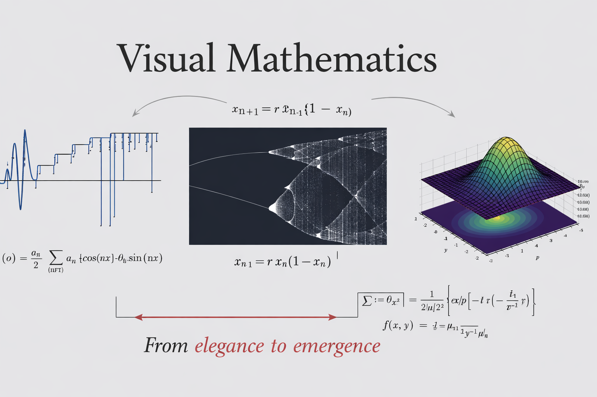

# Visual Mathematics

**Last updated:** 2026-01-22 06:10 UTC

<p align="center">
  
</p>

**Visual Mathematics** is an interactive collection of notebooks designed to build _intuition_ for mathematical, signal-processing, machine-learning and other concepts through **visualisation, interactivity, and direct manipulation of equations**.

Rather than presenting mathematics as static symbols on a page, this repository focuses on _seeing_ how mathematical objects behave: how parameters change shapes, how structure emerges, and how abstract formulas map onto concrete visuals.

The emphasis is on **understanding before formalism**, without sacrificing technical correctness.

## Project Philosophy

Many mathematical, signal-processing, and machine-learning ideas are not difficult because they are inherently complex, but because they are **experienced only through static symbols and final equations**. Too often, learners are asked to accept results without ever seeing how structure emerges, get a feel for how parameters influence behaviour, or why a particular formulation makes sense in the first place.

This creates a gap between "_knowing_" an equation and _understanding_ it.

In practice, most intuition is built through experimentation: changing a parameter, observing what breaks, noticing patterns, and gradually forming a mental model. However, traditional resources rarely support this process. Concepts are presented as fixed truths rather than dynamic systems, and learners are left to build intuition implicitly or not at all.

This project exists to address that gap.

**Visual Mathematics** treats mathematical objects as things you can _interact with_, not just write down. Sliders, widgets, and live plots are used to expose how equations behave under change, how geometry encodes algebra, and how abstract definitions translate into visible structure. The aim is not to simplify mathematics, but to make its internal logic more transparent.

This project is built around three principles:

- **Interactivity** – sliders, widgets, and controls allow parameters to be changed in real time
- **Visual grounding** – equations are always tied to plots, geometry, or distributions
- **Incremental intuition** – concepts are explored progressively, not presented as finished results

## Note from Author (Informal)

**Created on:** 2026-01-01 UTC<br>
**Published on:** 2026-01-13 UTC

The goal is not to replace textbooks or lectures, but to **complement them by making abstract ideas and formulas _feel obvious_...** I aim to make them **feel inevitable rather than arbitrary**. When a formula finally appears, it should feel like a natural conclusion of what has already been observed.

This project will never truly be "complete". At any given point, it reflects the boundary of what I currently understand and what I judge to be worth presenting—through visualisation. As my mathematical understanding deepens, the project will continue to evolve and grow by my side.

To make this explicit, an automatic timestamp is included below, indicating the most recent update to this repository or its contents.

**Last updated:** 2026-01-22 06:10 UTC

## Repository Structure

The repository is organised by conceptual domain, reflecting how these topics naturally build on one another.

```text
visual-mathematics/
├── README.md
├── requirements.txt
├── Math_Symbol_ReferenceSheet.pdf
├── image/
│   └── README_banner.png
├── notebooks/
│   ├── fundamental_mathematics/
│   │   └── TOC.md
│   ├── signal_processing/
│   │   └── TOC.md
│   └── machine_learning/
│       └── TOC.md
└── .github/
    └── workflows/
        └── readme-last-updated.yml
```

Each subfolder contains its own **Table of Contents** called `TOC.md`, describing the scope and assumed background for that domain.

<b>Note To Reader</b>: Mathematical notation is used frequently throughout this repository with the intent of familiarizing the reader with expressing core ideas in formal mathematical language, not just verbally but symbolically. Wherever possible, concepts are shown in their rigorous mathematical form to build fluency and precision.

For example, from the statement <i>“A Markov process makes predictions independent of the past/prior states given the present/current state”</i>, the statistical relation of the outcome from a markov can be compactly written as,

$$
\text{Future} \perp \!\!\! \perp \text{Past} \mid \text{Present}
$$

Refer to the Math_Symbol_ReferenceSheet.pdf (Topics listed below) if you come across any mathematical symbols/notations used within this repositry that may not be familiar to you. 

```text
Math_Symbol_ReferenceSheet.pdf
├── 1. Geometry and Linear Algebra
├── 2. Sets and Logic
├── 3. Probability and Statistics
├── 4. Probability and Statistics (Core Additions)
├── 5. Analysis and Asymptotics
├── 6. Linear Maps and Operators
├── 7. Advanced and Commonly Seen Symbols
└── 8. Quantifiers and Number Systems
```

## What This Project Covers

### Fundamental Mathematics

- Trigonometry (unit circle, sine/cosine geometry)
- Trigonometric identities through geometric interpretation
- Gaussian distributions and parameter effects
- Sampling behaviour and structure (e.g. Sobol vs random)

### Signal Processing (growing)

- Frequency-domain intuition
- Windowing and transforms
- Time–frequency representations
- Visual explanations of DSP operations

### Machine Learning (future expansion)

- Loss landscapes
- Optimisation behaviour
- Bias–variance intuition
- Probability distributions and geometry in ML contexts

## What This Project Does _Not_ Aim to Do

To keep expectations clear:

- This is **not** a formal course or curriculum
- It does **not** claim pedagogical completeness
- It does **not** focus on performance, benchmarking, or production code
- It is **not** intended as a replacement for mathematical rigor

The notebooks prioritise **clarity and intuition** over abstraction or efficiency.

## How to Use This Repository

1.  Clone the repository
2.  Install dependencies from `requirements.txt`
3.  Launch Jupyter Lab or Jupyter Notebook
4.  Open any notebook and interact with the widgets

Many notebooks rely on `ipywidgets`, so running them locally (rather than via static previews) is strongly recommended.

Edit: In the future., I MAY include a binder or hoted notebook (Once I get the time and actually figure out how to set one up that is.)

## Intended Audience

This project is suitable for:

- Students building intuition alongside formal study
- Engineers and scientists revisiting fundamentals
- Curious learners who prefer visual explanations
- Anyone who has thought _“I understand the equation, but I don’t quite feel it yet”_

The only assumed background is basic mathematical literacy and curiosity.

## Status and Ongoing Development (Formal acknowledgement)

This repository is **actively evolving**.

New notebooks will be added over time, existing ones refined, and concepts expanded as new ideas become visually interesting enough to explore.

There is no fixed endpoint by design.

## Acknowledgements

All notebooks alongside it's explanations, structure, intent, and technical decisions are a reflection of purely my own understanding and goals.
